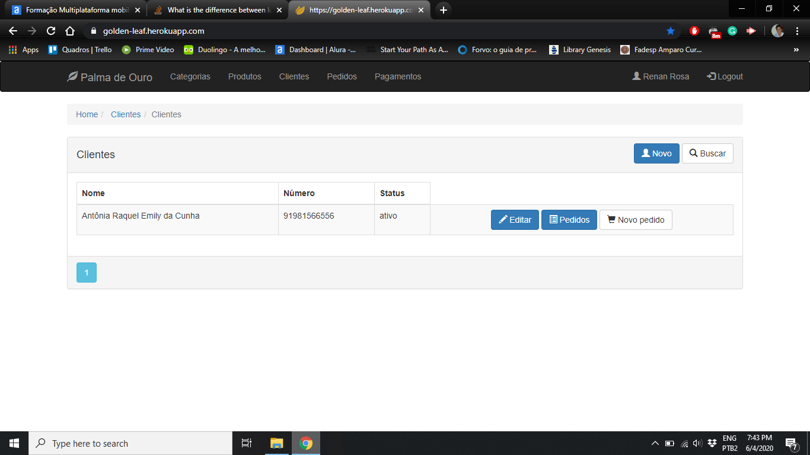

# Golden Leaf 
A small sized web app written in python for managing a family-sized small business.

## Getting Started

Once you have cloned the application's Git repository on GitHub build the project to make sure everything is okay. To ensure that you have all the dependencies installed, run the command below. If you are using VS 2019 it will do it automatically.

```
pip install -r requirements.txt
```

The app also has Javascript dependencies. Type the following commands on the root folder.
```
npm install
npm start
```

Also, remember to change the target database on the create_app function to TestingConfig if you want to run it locally

```
from app import create_app
from app.settings import ProductionConfig,TestingConfig

app = create_app(TestingConfig)
```

### Prerequisites

```
python 3.7
```
## Screen shots



## Working demo

https://golden-leaf.herokuapp.com/